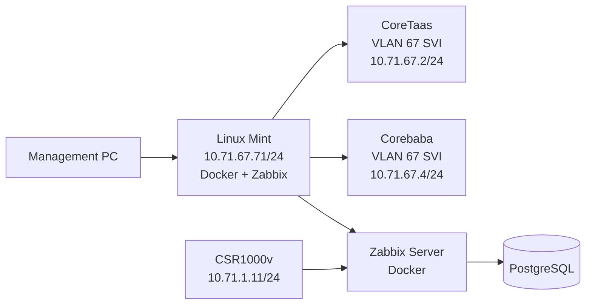

# Linux Mint + Docker + Zabbix + Cisco Core Switch + CSR1000v Network Monitoring Lab

A hands-on lab documenting how a Linux Mint PC was turned into a Docker-based Zabbix monitoring server, connected to Cisco core switches over VLAN 67, and used to monitor a Cisco CSR1000v router through SNMP.

> **LAB NOTICE:** Every credential in this document (`Admin / zabbix`, the PostgreSQL password `zabbix`, and the SNMP community `public`) is a **LAB/DEMO value only**. Never use them in production.

---

## Table of Contents

1. [Introduction](#1-introduction)
2. [Lab Objectives](#2-lab-objectives)
3. [Lab Topology](#3-lab-topology)
4. [Lab Addressing](#4-lab-addressing)
5. [Prerequisites](#5-prerequisites)
6. [Install Docker on Linux Mint](#6-install-docker-on-linux-mint)
7. [Install Zabbix Using Docker Compose](#7-install-zabbix-using-docker-compose)
8. [Validate Docker Compose](#8-validate-docker-compose)
9. [Start Zabbix](#9-start-zabbix)
10. [Zabbix Web Interface](#10-zabbix-web-interface)
11. [Static IPv4 Configuration on Linux Mint](#11-static-ipv4-configuration-on-linux-mint)
12. [Core Switch Configuration](#12-core-switch-configuration)
13. [Linux Mint Static Routes](#13-linux-mint-static-routes)
14. [Management PC to Linux Mint Connectivity](#14-management-pc--linux-mint-connectivity)
15. [SSH Access](#15-ssh-access)
16. [CSR1000v Virtual Machine Configuration](#16-csr1000v-virtual-machine-configuration)
17. [CSR1000v Configuration](#17-csr1000v-configuration)
18. [Install SNMP Utilities on Linux Mint](#18-install-snmp-utilities-on-linux-mint)
19. [Configure SNMP on CSR1000v](#19-configure-snmp-on-csr1000v)
20. [Ping Requirement](#20-ping-requirement)
21. [Add CSR1000v to Zabbix](#21-add-csr1000v-to-zabbix)
22. [Wait for Initial SNMP Monitoring](#22-wait-for-initial-snmp-monitoring)
23. [Final Zabbix State](#23-final-zabbix-state)
24. [Linux Resource Monitoring](#24-linux-resource-monitoring)
25. [Network Link Troubleshooting](#25-network-link-troubleshooting)
26. [Core Switch Link Troubleshooting](#26-core-switch-link-troubleshooting)
27. [Routing Troubleshooting](#27-routing-troubleshooting)
28. [Docker / Zabbix Troubleshooting](#28-docker--zabbix-troubleshooting)
29. [SNMP Troubleshooting](#29-snmp-troubleshooting)
30. [Security Considerations](#30-security-considerations)
31. [Lab Limitations](#31-lab-limitations)
32. [Lessons Learned](#32-lessons-learned)
33. [Quick Command Reference](#33-quick-command-reference)
34. [Final Verification Checklist](#34-final-verification-checklist)
35. [Final Summary](#35-final-summary)

---

## How to Read the Commands

Every command block is labeled with the device it runs on.

| Label | Where to run it | Shell / syntax |
|---|---|---|
| **LINUX MINT** | Terminal on the Linux Mint PC | Bash |
| **CORETAAS** | Cisco core switch "CoreTaas" | Cisco IOS |
| **COREBABA** | Cisco core switch "Corebaba" | Cisco IOS |
| **CSR1000v** | Cisco CSR1000v router | Cisco IOS |
| **MANAGEMENT PC** | The admin's workstation | Command prompt / terminal |

Linux commands use Bash syntax (` ```bash `). Cisco commands use IOS syntax (` ```cisco `). Do not paste one into the other.

---

## 1. Introduction

This project documents the setup of a **Linux Mint PC** that was given a **static IPv4 address** and connected to **Cisco core switches**. The PC was then configured as a **Docker host** running four containers:

- PostgreSQL (database)
- Zabbix Server
- Zabbix Web Interface
- Zabbix Agent 2

After the Linux Mint network configuration was complete, **static routing** was configured between the Linux Mint network and the Cisco core switches. A **Cisco CSR1000v** router was then configured and added to Zabbix using **SNMP**. The final goal was to **monitor the CSR1000v through Zabbix**.

### Skills demonstrated

- Linux administration
- Static IPv4 configuration
- VLAN configuration
- Layer 3 switching
- Static routing
- Cisco IOS configuration
- Docker and Docker Compose
- PostgreSQL
- Zabbix
- SNMP
- Network monitoring
- Network troubleshooting

---

## 2. Lab Objectives

1. Configure Linux Mint with a static IPv4 address.
2. Install Docker.
3. Verify Docker installation.
4. Deploy Zabbix using Docker Compose.
5. Configure PostgreSQL for Zabbix.
6. Access the Zabbix web interface.
7. Configure VLAN 67 on the core switches.
8. Configure SVIs on the core switches.
9. Connect Linux Mint to the core switch.
10. Configure static routes.
11. Verify Linux Mint connectivity.
12. Configure the CSR1000v.
13. Configure routing on the CSR1000v.
14. Configure SNMP.
15. Add the CSR1000v to Zabbix.
16. Verify SNMP availability.
17. Monitor CPU, memory, interfaces, and other metrics.
18. Troubleshoot connectivity and link problems.

---

## 3. Lab Topology



> **Note:** This diagram shows the **logical** topology (which device talks to which). The actual **physical** and VMware topology may differ. In particular, the exact link between the core switches and the CSR1000v, and the CSR next-hop `10.71.1.4`, must be verified against the real lab.

---

## 4. Lab Addressing

| Device | Interface | IP Address | Subnet | Purpose |
|---|---|---|---|---|
| Linux Mint | `enp2s0` | 10.71.67.71 | /24 | Zabbix server host |
| CoreTaas | VLAN 67 (SVI) | 10.71.67.2 | /24 | Layer 3 gateway / routing |
| Corebaba | VLAN 67 (SVI) | 10.71.67.4 | /24 | Layer 3 gateway |
| CSR1000v | GigabitEthernet1 | 10.71.1.11 | /24 | SNMP-monitored router |
| Zabbix Web | Linux Mint | 10.71.67.71:8080 | n/a | Web interface |
| Zabbix Server | Linux Mint | 10.71.67.71:10051 | n/a | Zabbix server port |

> **Always verify IP addressing against your actual lab topology** before applying any configuration.

---

## 5. Prerequisites

- Linux Mint PC with an Ethernet connection
- Internet access (to download Docker packages and container images)
- `sudo` / root access
- Cisco core switches
- Cisco CSR1000v
- VMware or another virtualization platform
- Docker and Docker Compose (installed in Section 6)
- Zabbix (deployed in Section 7)
- Management PC
- SSH client such as SecureCRT
- Basic knowledge of Linux and Cisco IOS

---

## 6. Install Docker on Linux Mint

Linux Mint is based on Ubuntu, so the official Docker repository for Ubuntu is used. All commands in this section run on **LINUX MINT**.

### 6.1 Remove old Docker repository configuration

```bash
sudo rm -f /etc/apt/sources.list.d/docker.lis
```

Removes an old or mistyped repository file (`docker.lis` instead of `docker.list`) if one exists. `-f` means no error if the file is missing.

### 6.2 Update packages

```bash
sudo apt update
```

Refreshes the list of available packages.

### 6.3 Install prerequisites

```bash
sudo apt install -y ca-certificates curl
```

- `ca-certificates` lets the system trust HTTPS websites.
- `curl` downloads files from the command line (used for the Docker key).

### 6.4 Create Docker keyring directory

```bash
sudo install -m 0755 -d /etc/apt/keyrings
```

Creates the folder that stores repository signing keys, with permissions `755`.

### 6.5 Download Docker GPG key

```bash
sudo curl -fsSL https://download.docker.com/linux/ubuntu/gpg -o /etc/apt/keyrings/docker.asc
```

Downloads Docker's public signing key so `apt` can verify the packages are genuine.

### 6.6 Set permissions

```bash
sudo chmod a+r /etc/apt/keyrings/docker.asc
```

Makes the key readable by all users (required for `apt`).

### 6.7 Verify key

```bash
head -1 /etc/apt/keyrings/docker.asc
```

Expected first line: `-----BEGIN PGP PUBLIC KEY BLOCK-----`.

### 6.8 Add Docker repository

```bash
echo "deb [arch=$(dpkg --print-architecture) signed-by=/etc/apt/keyrings/docker.asc] https://download.docker.com/linux/ubuntu $(. /etc/os-release && echo "$UBUNTU_CODENAME") stable" | sudo tee /etc/apt/sources.list.d/docker.list
```

Builds the repository line using your CPU architecture and the underlying Ubuntu codename (`UBUNTU_CODENAME`, which Linux Mint provides), then saves it to `docker.list`.

### 6.9 Update repositories

```bash
sudo apt update
```

### 6.10 Install Docker

```bash
sudo apt install -y docker-ce docker-ce-cli containerd.io docker-buildx-plugin docker-compose-plugin
```

| Package | Purpose |
|---|---|
| `docker-ce` | Docker Engine (the background service that runs containers) |
| `docker-ce-cli` | The `docker` command-line tool |
| `containerd.io` | Container runtime used by Docker |
| `docker-buildx-plugin` | Advanced image-building features |
| `docker-compose-plugin` | Adds the `docker compose` command |

### 6.11 Add user to Docker group

```bash
sudo usermod -aG docker $USER
```

Lets your user run Docker without `sudo`. Then start a new session:

```bash
sudo -iu $USER
```

Group membership only takes effect on a **new login/session**. If `docker` still says "permission denied", log out and back in.

### 6.12 Test Docker

```bash
docker run hello-world
```

```bash
docker --version
docker compose version
systemctl status docker
docker ps
```

**What success looks like:**

| Command | Successful result |
|---|---|
| `docker run hello-world` | Prints "Hello from Docker!" |
| `docker --version` | Shows a Docker version number |
| `docker compose version` | Shows a Compose version number |
| `systemctl status docker` | Shows `active (running)` in green |
| `docker ps` | Runs without error (list may be empty) |

---

## 7. Install Zabbix Using Docker Compose

**LINUX MINT:**

```bash
mkdir -p ~/zabbix && cd ~/zabbix
```

Create `docker-compose.yml` in this folder (for example with `nano docker-compose.yml`):

```yaml
services:
  postgres:
    image: postgres:15
    environment:
      POSTGRES_USER: zabbix
      POSTGRES_PASSWORD: zabbix
      POSTGRES_DB: zabbix
    volumes:
      - zbx-db:/var/lib/postgresql/data

  zabbix-server:
    image: zabbix/zabbix-server-pgsql:alpine-7.0-latest
    depends_on:
      - postgres
    environment:
      DB_SERVER_HOST: postgres
      POSTGRES_USER: zabbix
      POSTGRES_PASSWORD: zabbix
      POSTGRES_DB: zabbix
    ports:
      - "10051:10051"

  zabbix-web:
    image: zabbix/zabbix-web-nginx-pgsql:alpine-7.0-latest
    depends_on:
      - zabbix-server
    environment:
      ZBX_SERVER_HOST: zabbix-server
      DB_SERVER_HOST: postgres
      POSTGRES_USER: zabbix
      POSTGRES_PASSWORD: zabbix
      POSTGRES_DB: zabbix
      PHP_TZ: Asia/Manila
    ports:
      - "8080:8080"

  zabbix-agent:
    image: zabbix/zabbix-agent2:alpine-7.0-latest
    environment:
      ZBX_HOSTNAME: "Zabbix server"
      ZBX_SERVER_HOST: zabbix-server

volumes:
  zbx-db:
```

> `zabbix` as the database user/password is a **LAB value**. Use strong, secret credentials in real deployments.

### What each service does

| Service | Role |
|---|---|
| **PostgreSQL** | Database backend. Stores all Zabbix configuration and collected data. |
| **Zabbix Server** | The engine. Collects and processes monitoring data, evaluates triggers. Listens on port `10051`. |
| **Zabbix Web** | The nginx + PHP web interface for managing Zabbix. Published on port `8080`; timezone set to `Asia/Manila`. |
| **Zabbix Agent 2** | Lets Zabbix monitor the Linux server itself (hostname `Zabbix server`). |
| **`zbx-db` volume** | Persistent storage for PostgreSQL, so data survives container restarts and recreation. |

> **Important:** The `zbx-db` volume holds all your Zabbix data. **Removing it deletes your hosts, templates, history, and settings.**

---

## 8. Validate Docker Compose

**LINUX MINT** (inside `~/zabbix`):

```bash
docker compose config --quiet && echo "OK: docker-compose.yml is valid"
```

Checks the file for syntax errors without starting anything. If valid, it prints the OK message; otherwise it shows the error and line.

---

## 9. Start Zabbix

**LINUX MINT:**

```bash
systemctl start docker
docker compose up -d
docker compose ps
```

(If you are not root, use `sudo systemctl start docker`.)

- `docker compose up -d` downloads images (first run) and starts all containers in the background.
- `docker compose ps` should show every service with status **Up**.

Check the server logs:

```bash
docker compose logs zabbix-server | grep -iE "schema|started|error|cannot" | tail -20
```

| Log pattern | Meaning |
|---|---|
| Lines containing `started` (for example "server #1 started") | Good, Zabbix processes are running |
| Schema creation/import messages on first run | Good, the database is being initialized |
| `cannot connect`, `error`, `cannot` | Problem, usually the database is not ready or credentials do not match |

On first start the server may log a few connection errors while PostgreSQL initializes. If they stop and "started" lines appear, it is healthy.

---

## 10. Zabbix Web Interface

On the Linux Mint PC, open:

```text
http://127.0.0.1:8080
```

Credentials used in this lab:

```text
Username: Admin
Password: zabbix
```

> **These are lab credentials only. The default password must be changed in any real or production deployment.**

From another computer on the network (if routing and firewall allow it):

```text
http://10.71.67.71:8080
```

---

## 11. Static IPv4 Configuration on Linux Mint

Addressing plan:

```text
IP Address: 10.71.67.71
Netmask:    255.255.255.0
Prefix:     /24
Gateway:    10.71.67.4
Interface:  enp2s0
```

**LINUX MINT:**

```bash
sudo su

nmcli connection add \
  type ethernet \
  con-name BRIDGED \
  ifname enp2s0 \
  ipv4.method manual \
  ipv4.addresses 10.71.67.71/24 \
  ipv4.gateway 10.71.67.4 \
  autoconnect yes
```

> **Correction:** the original notes used `ipv4.addressing`, which is not a valid NetworkManager property. The correct property is `ipv4.addresses`.

| Parameter | Meaning |
|---|---|
| `nmcli connection add` | Create a new NetworkManager connection profile |
| `type ethernet` | Wired Ethernet connection |
| `con-name BRIDGED` | Name of the profile (any label you choose) |
| `ifname enp2s0` | The network interface this profile applies to |
| `ipv4.method manual` | Use a static IP instead of DHCP |
| `ipv4.addresses 10.71.67.71/24` | The static address and prefix length |
| `ipv4.gateway 10.71.67.4` | Default gateway (Corebaba SVI) |
| `autoconnect yes` | Activate automatically at boot |

If the profile does not apply right away:

```bash
nmcli connection up BRIDGED
```

**Verification:**

```bash
ip addr
ip route
nmcli connection show
```

**Test the gateway:**

```bash
ping -c 4 10.71.67.4
```

---

## 12. Core Switch Configuration

VLAN 67 was created for the Linux Mint network. Both core switches get an SVI (a Layer 3 interface for the VLAN) in the same subnet.

### CORETAAS

```cisco
conf t

vlan 67
 name VMLinux

interface vlan 67
 description Linux_Mint
 no shutdown
 ip address 10.71.67.2 255.255.255.0

interface g0/1
 switchport
 switchport mode access
 switchport access vlan 67

ip routing
```

### COREBABA

```cisco
conf t

vlan 67
 name VMLinux

interface vlan 67
 description ServiceLinux
 no shutdown
 ip address 10.71.67.4 255.255.255.0
```

> The inappropriate interface description in the original notes was replaced with the professional descriptions `Linux_Mint` and `ServiceLinux`.

### Concepts

| Term | Explanation |
|---|---|
| **VLAN 67** | A virtual LAN that separates the Linux Mint traffic at Layer 2. Named `VMLinux`. |
| **SVI** | Switch Virtual Interface (`interface vlan 67`). Gives the VLAN an IP address so the switch can route for it. |
| **Access port** | `switchport mode access` makes `g0/1` carry one untagged VLAN, which suits an end device like the Linux PC. |
| **VLAN assignment** | `switchport access vlan 67` places that port into VLAN 67. |
| **`ip routing`** | Turns a Layer 3 switch into a router so it can route between subnets. |

**Verification (run on each switch):**

```cisco
show vlan brief
show ip interface brief
show ip route
show interfaces status
```

Confirm VLAN 67 exists, `Vlan67` is up/up, and the port assigned to VLAN 67 is `connected`.

> **Needs verification:** The notes show the Linux Mint gateway as `10.71.67.4` (Corebaba) but the static routes use `10.71.67.2` (CoreTaas) as next hop. Confirm which switch is actually the intended gateway for each purpose in your topology.

---

## 13. Linux Mint Static Routes

Disable the firewall for the lab test:

**LINUX MINT:**

```bash
sudo ufw disable
```

> **Warning:** Disabling UFW is only acceptable for this lab test. It is **not recommended as a permanent or production configuration.** Re-enable it with `sudo ufw enable` and allow only the ports you need.

Add routes:

```bash
sudo ip route add 10.0.0.0/8 via 10.71.67.2
sudo ip route add 200.0.0.0/24 via 10.71.67.2
```

| Route | What it does |
|---|---|
| `10.0.0.0/8 via 10.71.67.2` | Sends traffic for any 10.x.x.x address (including the CSR1000v at `10.71.1.11`) to CoreTaas. The more specific local `10.71.67.0/24` network still takes priority for local traffic. |
| `200.0.0.0/24 via 10.71.67.2` | Sends traffic for 200.0.0.0/24 to CoreTaas. |

**Verification:**

```bash
ip route
ip route get 10.0.0.1
ip route get 200.0.0.1
```

`ip route get` shows exactly which route and next hop Linux will use for a destination.

### Making routes persistent

Routes added with `ip route add` are **temporary** and may disappear after a reboot or network restart. To make them permanent, add them to the NetworkManager profile:

```bash
sudo nmcli connection modify BRIDGED +ipv4.routes "10.0.0.0/8 10.71.67.2"
sudo nmcli connection modify BRIDGED +ipv4.routes "200.0.0.0/24 10.71.67.2"
sudo nmcli connection up BRIDGED
```

---

## 14. Management PC to Linux Mint Connectivity

The management PC and Linux Mint must be able to communicate.

**MANAGEMENT PC:**

```text
ping 10.71.67.71
```

**LINUX MINT:**

```bash
ping -c 4 <management-PC-IP>
```

`<management-PC-IP>` is a placeholder; use the real address of your management PC. A successful reply confirms basic Layer 3 connectivity in both directions.

---

## 15. SSH Access

**MANAGEMENT PC** (or from SecureCRT):

```bash
ssh <username>@10.71.67.71
```

Requirements:

- SSH uses **TCP port 22**.
- Linux Mint must be reachable (ping works).
- The SSH service must be running on Linux Mint (`sudo apt install openssh-server` if missing, then `systemctl status ssh`).
- Firewall rules must allow SSH.

**SecureCRT** can be used as the SSH client: create a new session, protocol SSH2, hostname `10.71.67.71`, and your Linux username.

---

## 16. CSR1000v Virtual Machine Configuration

VMware network adapters used for the CSR1000v VM:

```text
Network Adapter 1: Bridged (Automatic)
Network Adapter 2: Custom (VMnet2)
Network Adapter 3: NAT
```

> VMware adapter names and the adapter-to-interface mapping vary by lab environment. Check which adapter corresponds to `GigabitEthernet1` in your setup.

---

## 17. CSR1000v Configuration

All commands in this section run on **CSR1000v**.

**Interface:**

```cisco
conf t

interface GigabitEthernet1
 ip address 10.71.1.11 255.255.255.0
 no shutdown

end
```

**VTY (remote login) lines:**

```cisco
conf t

line vty 0 14
 exec-timeout 0 0
 login local

end
```

- `exec-timeout 0 0` disables the idle timeout (convenient for a lab, not for production).
- `login local` authenticates with a local username. A local user must exist (for example created with `username <name> privilege 15 secret <password>`); do not use real credentials in public documentation.

**Static routes:**

```cisco
conf t

ip route 10.0.0.0 255.0.0.0 10.71.1.4
ip route 200.0.0.0 255.255.255.0 10.71.1.4

end
```

| Route | Meaning |
|---|---|
| `10.0.0.0 255.0.0.0 via 10.71.1.4` | Send all 10.x.x.x traffic (including Linux Mint `10.71.67.71`) to next hop `10.71.1.4`. |
| `200.0.0.0 255.255.255.0 via 10.71.1.4` | Send 200.0.0.0/24 traffic to the same next hop. |

> **Needs verification:** `10.71.1.4` is the next hop given in the notes; which device owns this address is not stated. Confirm it on your topology.

**Verification:**

```cisco
show ip interface brief
show ip route
```

**Connectivity:**

```cisco
ping 10.71.1.4
ping 10.71.67.71
```

---

## 18. Install SNMP Utilities on Linux Mint

**LINUX MINT:**

```bash
sudo apt install snmp -y
```

> **Correction:** the original notes used `net-snmp-utils`, which is the Red Hat/CentOS package name. On Linux Mint (Debian/Ubuntu family) the package is `snmp`.

This provides tools such as `snmpwalk` and `snmpget` to test SNMP before adding the device to Zabbix. Example test:

```bash
snmpwalk -v2c -c public 10.71.1.11 system
```

If this returns system information (name, description, uptime), SNMP and routing work end to end.

---

## 19. Configure SNMP on CSR1000v

**CSR1000v:**

```cisco
conf t

access-list 10 permit 10.71.67.71
snmp-server community public RO 10

end
```

| Element | Meaning |
|---|---|
| `access-list 10 permit 10.71.67.71` | Only the Linux Mint host may query SNMP. |
| `public` | The SNMP community string (like a shared password). **LAB value only.** |
| `RO` | Read-only: Zabbix can read data but not change the device. |
| `10` | References ACL 10 to restrict who may use this community. |

> **Security warning:** `public` is used intentionally for this lab but is **NOT secure for production**. In production:
> - use **SNMPv3**
> - use **authentication** and **encryption**
> - restrict management access
> - use dedicated management networks

---

## 20. Ping Requirement

Linux Mint and the CSR1000v **must be able to ping each other** before you configure Zabbix SNMP monitoring.

**LINUX MINT:**

```bash
ping -c 4 10.71.1.11
```

**CSR1000v:**

```cisco
ping 10.71.67.71
```

If either fails, troubleshoot routing (Sections 26 and 27) before continuing.

---

## 21. Add CSR1000v to Zabbix

In the Zabbix web interface:

```text
Data Collection
→ Hosts
→ Create Host
```

Configure:

```text
Host name:
zabbix-fw1k

Template:
Cisco IOS by SNMP

Host group:
Virtual machines
```

Add interface:

```text
Type:
SNMP

IP:
10.71.1.11
```

Then press:

```text
Add
```

For the SNMP interface, set the SNMP version to match the device (v2c in this lab) and the community to the lab value (`public`; Zabbix's default is the macro `{$SNMP_COMMUNITY}`). Zabbix then uses SNMP to poll the CSR1000v for CPU, memory, interface, and other data.

---

## 22. Wait for Initial SNMP Monitoring

Wait approximately **3 to 5 minutes** for the initial SNMP monitoring data to appear.

Go to:

```text
Data Collection → Hosts
```

Look at the availability indicator. A **green SNMP indicator** means Zabbix is communicating successfully with the CSR1000v through SNMP.

Then check:

```text
Monitoring → Latest data
```

Look for:

- CPU utilization
- Memory utilization
- Interface traffic
- Interface status
- Packet statistics
- Other SNMP data

---

## 23. Final Zabbix State

| Item | Value |
|---|---|
| Zabbix web interface | `10.71.67.71:8080` |
| Zabbix server host (agent) | `127.0.0.1:10050` |
| CSR1000v SNMP | `10.71.1.11:161` |
| Zabbix host name | `zabbix-fw1k` |
| Template | Cisco IOS by SNMP |
| Monitoring method | SNMP |

The Hosts page should show the CSR1000v as **Enabled**, and the SNMP availability indicator should turn **green** after successful communication.

---

## 24. Linux Resource Monitoring

**LINUX MINT:**

```bash
htop
```

```bash
free -h
top
```

| Metric | What it shows |
|---|---|
| CPU usage | How busy each processor core is |
| RAM usage | Memory in use versus available |
| Swap | Disk space used as overflow memory (heavy swap use signals memory pressure) |
| Processes | What is consuming resources |
| Load average | Average system load over 1, 5, and 15 minutes |

`htop` was used during troubleshooting to watch system resource usage while Docker and Zabbix were running. `free -h` shows memory in human-readable units; `top` is the classic alternative to `htop`.

---

## 25. Network Link Troubleshooting

**LINUX MINT:**

```bash
sudo ethtool enp2s0
```

Observed during the lab:

```text
Supported link modes:
10baseT
100baseT
1000baseT

Link partner advertised:
10baseT
100baseT

Speed:
100Mb/s

Duplex:
Full

Auto-negotiation:
on

Link detected:
yes
```

**Interpretation:** The Linux Mint NIC supports Gigabit Ethernet, but the link partner advertised only 10/100 Mbps during the test. Therefore, the connection negotiated at **100 Mbps Full Duplex**.

Possible reasons:

- Ethernet cable (damaged or low quality; Gigabit needs all four pairs working)
- Switch port (hardware or configuration limit)
- NIC
- Port configuration (speed forced or limited)
- Auto-negotiation problems
- Network adapter / VM configuration

**Continuous monitoring:**

```bash
watch -n 1 "ethtool enp2s0 | grep -E 'Speed|Duplex|Link detected'"
```

If the output keeps alternating between:

```text
Link detected: yes
Link detected: no
```

this indicates possible **link flapping**, typically a Layer 1 problem.

---

## 26. Core Switch Link Troubleshooting

**CORETAAS / COREBABA:**

```cisco
show interfaces status
show interfaces <PORT>
show logging | include UPDOWN
```

Look for:

- CRC errors
- Input errors
- Output errors
- Interface resets
- Repeated UP/DOWN events

If the physical switch port indicator repeatedly turns on and off, **investigate Layer 1 first** before focusing on routing or Zabbix.

Recommended checks:

1. Replace the Ethernet cable.
2. Test another switch port.
3. Check the NIC.
4. Check the switch port configuration.
5. Check speed/duplex negotiation.
6. Check the VLAN configuration.

---

## 27. Routing Troubleshooting

Work from the **lowest layer upward**.

**LINUX MINT:**

```bash
ip addr
ip route
ip route get <destination>
ip neigh
ping -c 4 <destination>
```

**CISCO (switches / CSR1000v):**

```cisco
show ip interface brief
show ip route
ping <destination>
```

| Layer | What to check |
|---|---|
| **Layer 1** | Cable, NIC, link state |
| **Layer 2** | VLAN, switchport, MAC learning |
| **Layer 3** | IP address, subnet mask, gateway, routing, ACLs |
| **Application** | SNMP, Zabbix, Docker |

Typical problems from this lab: ping failures between Linux Mint and the CSR1000v were routing issues (a missing or wrong route, or a wrong next hop on one side). Remember routing must exist in **both directions**: a ping needs the reply to find its way back.

---

## 28. Docker / Zabbix Troubleshooting

**Problem encountered: Zabbix needed to be started after Linux Mint was shut down.**

If Zabbix does not start:

```bash
systemctl status docker
docker ps
docker compose ps
docker compose logs zabbix-server
docker compose logs zabbix-web
```

Start Docker:

```bash
sudo systemctl start docker
```

Start Zabbix (from `~/zabbix`):

```bash
docker compose up -d
```

Zabbix **does not need to be reinstalled** after simply shutting down Linux Mint. The data lives in the `zbx-db` volume.

Normal stop:

```bash
docker compose stop
```

Normal start:

```bash
docker compose start
```

> **Important:** Do **not** use the following unless you intentionally want to delete the Docker volumes and all database data:
>
> ```bash
> docker compose down -v
> ```

Enable Docker at boot:

```bash
sudo systemctl enable docker
```

Note: Compose services have no `restart:` policy in this file, so containers may not auto-start after a reboot. Running `docker compose up -d` after boot restores them. Adding `restart: unless-stopped` to each service is a common fix.

---

## 29. SNMP Troubleshooting

If the Zabbix SNMP availability is not green, check:

1. Linux Mint can ping the CSR1000v.
2. The CSR1000v can ping Linux Mint.
3. The CSR interface is up.
4. The correct IP address is configured in Zabbix.
5. The SNMP community string is correct.
6. The ACL permits Linux Mint.
7. UDP/161 is reachable.
8. The correct Cisco IOS template is applied.

**CSR1000v:**

```cisco
show access-lists
show running-config | include snmp
show ip interface brief
```

**LINUX MINT:**

```bash
ping -c 4 10.71.1.11
snmpwalk -v2c -c public 10.71.1.11 system
```

If ping works but `snmpwalk` times out, focus on the community string, ACL 10, and UDP/161 filtering.

---

## 30. Security Considerations

- Change the default Zabbix password.
- Never commit passwords to GitHub.
- Never commit private keys.
- Do not use `public` SNMP community strings in production.
- Prefer SNMPv3.
- Restrict SNMP access using ACLs.
- Do not permanently disable UFW.
- Restrict access to Zabbix port 8080.
- Protect PostgreSQL (do not publish its port externally; in this setup it is not).
- Use strong database passwords.
- Use secrets or environment variables for credentials (for example a `.env` file excluded from Git).
- Use least privilege.
- Restrict Docker administration access (membership in the `docker` group is effectively root access).

---

## 31. Lab Limitations

- This is a controlled lab environment.
- Example credentials are used.
- SNMPv2c with a community string is used for demonstration.
- Static routes were configured manually.
- Some manually added routes may not survive a reboot.
- The Docker Compose setup is intended for lab use.
- VMware networking depends on the local virtualization configuration.
- The Linux Ethernet connection negotiated at 100 Mbps during testing.
- The exact physical topology may differ from the logical topology.

---

## 32. Lessons Learned

**Linux**
Static IP addressing with NetworkManager, the difference between temporary (`ip route add`) and persistent routes, and the effect of the firewall on connectivity.

**Networking**
How VLANs, SVIs, and access ports fit together; how static routing needs matching routes in both directions; and how to troubleshoot across Layers 1, 2, and 3.

**Cisco**
IOS interface and routing configuration, using ACLs to limit who can reach a service, and enabling SNMP.

**Docker**
Docker Engine versus Docker Compose, how containers relate to each other, and why named volumes preserve data.

**Zabbix**
How the server, agent, PostgreSQL, templates, and hosts fit together, and how SNMP monitoring is added to a host.

**Troubleshooting approach**

- Test connectivity before configuring applications.
- Identify the layer where the problem exists.
- Verify physical connectivity first.
- Verify IP addressing and routing next.
- Verify application-level protocols (SNMP, Zabbix) last.

---

## 33. Quick Command Reference

### Linux

| Command | Purpose |
|---|---|
| `ip addr` | Show IP addresses |
| `ip route` | Show routing table |
| `ip route get <IP>` | Show route used for a destination |
| `ip neigh` | Show ARP/neighbor table |
| `ping -c 4 <IP>` | Send 4 pings |
| `sudo ethtool enp2s0` | Show link speed/duplex |
| `nmcli connection show` | List NetworkManager connections |
| `sudo ufw status` | Show firewall status |
| `htop` | Interactive resource monitor |
| `free -h` | Show memory usage |

### Docker

| Command | Purpose |
|---|---|
| `docker --version` | Show Docker version |
| `docker compose version` | Show Compose version |
| `docker ps` | List running containers |
| `docker compose ps` | List Compose services |
| `docker compose up -d` | Create and start services |
| `docker compose stop` | Stop services (keeps data) |
| `docker compose start` | Start stopped services |
| `docker compose logs zabbix-server` | View Zabbix server logs |
| `systemctl status docker` | Check Docker service |

### Cisco

| Command | Purpose |
|---|---|
| `show ip interface brief` | Interface IPs and status |
| `show ip route` | Routing table |
| `show vlan brief` | VLAN list |
| `show interfaces status` | Port status, speed, duplex |
| `show interfaces <PORT>` | Detailed port counters/errors |
| `show access-lists` | ACL contents and hit counts |
| `show logging \| include UPDOWN` | Link up/down events |
| `show running-config` | Current configuration |
| `ping <IP>` | Connectivity test |

---

## 34. Final Verification Checklist

- [ ] Linux Mint has static IP 10.71.67.71/24
- [ ] Linux Mint interface enp2s0 is up
- [ ] Linux Mint can ping the gateway
- [ ] Management PC can ping Linux Mint
- [ ] SSH works
- [ ] Docker is installed
- [ ] Docker service is running
- [ ] Docker Compose is working
- [ ] PostgreSQL container is running
- [ ] Zabbix server container is running
- [ ] Zabbix web container is running
- [ ] Zabbix web UI is accessible
- [ ] CoreTaas VLAN 67 is configured
- [ ] Corebaba VLAN 67 is configured
- [ ] Static routes are configured
- [ ] CSR1000v interface is up
- [ ] CSR1000v routing is configured
- [ ] Linux Mint can ping CSR1000v
- [ ] CSR1000v can ping Linux Mint
- [ ] SNMP is configured
- [ ] Zabbix host zabbix-fw1k exists
- [ ] Cisco IOS by SNMP template is applied
- [ ] SNMP availability is green
- [ ] Latest data is being collected
- [ ] CPU/memory/interface metrics are visible

---

## 35. Final Summary

This lab combined **Linux Mint, Docker, PostgreSQL, Zabbix, Cisco core switching, static routing, a CSR1000v router, and SNMP** into a functional network monitoring environment. The Linux Mint PC serves as the Docker/Zabbix host, reachable through VLAN 67 on the Cisco core switches, and the CSR1000v is monitored through SNMP, with CPU, memory, and interface metrics collected in Zabbix.

The lab also showed the value of systematic troubleshooting: verifying the physical link first (including a 100 Mbps negotiation and link-flap checks), then addressing and routing, and only then the SNMP and Zabbix application layer.

> All credentials and community strings shown are **lab/demo values**. Harden them before any real deployment.
