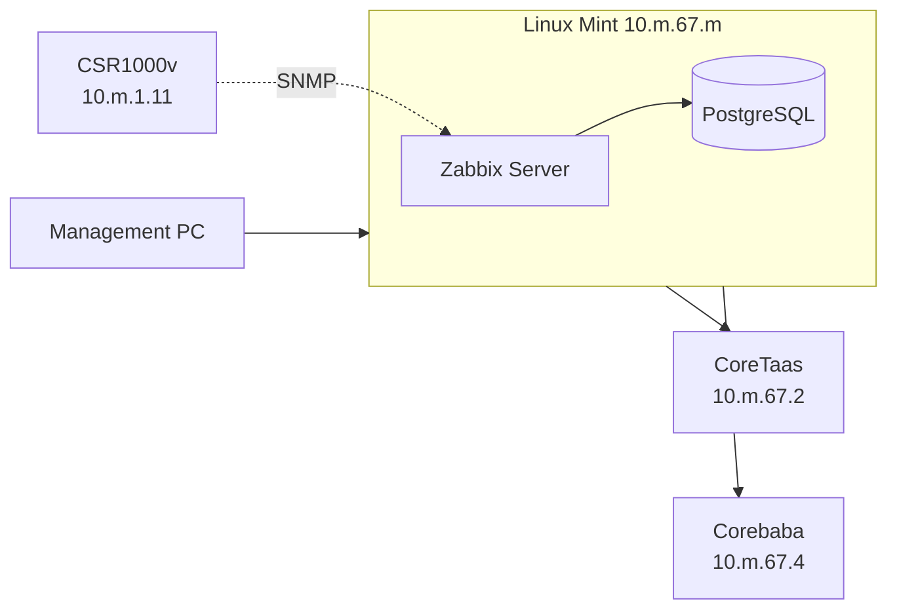

<div align="center">

# Network Monitoring Lab

**Linux Mint &nbsp;/&nbsp; Docker &nbsp;/&nbsp; Zabbix &nbsp;/&nbsp; Cisco Core Switches &nbsp;/&nbsp; CSR1000v**


*A Linux Mint PC becomes a Dockerized Zabbix server and monitors a Cisco CSR1000v over SNMP.*

</div>

> **Lab credentials only.** `Admin / zabbix`, the database password `zabbix`, and the SNMP community `public` are demo values. Never use them in production.

---

## Contents

[Overview](#overview) · [Addressing](#addressing) · [1. Linux host](#1-linux-host) · [2. Zabbix](#2-zabbix-in-docker) · [3. Core switches](#3-core-switches) · [4. Routing](#4-linux-static-routes) · [5. CSR1000v and SNMP](#5-csr1000v-and-snmp) · [6. Add to Zabbix](#6-add-the-csr1000v-to-zabbix) · [Troubleshooting](#troubleshooting) · [Security and limits](#security-and-limitations) · [Checklist](#final-verification-checklist)

---

## Overview

Linux Mint gets a static IP on **VLAN 67**, hangs off two Cisco core switches, runs Zabbix in Docker, and uses static routes plus SNMP to reach and monitor a CSR1000v.



*Logical topology. The physical and VMware layout may differ.*

**Command labels used below**

| Label | Runs on | Syntax |
|---|---|---|
| LINUX MINT | Linux Mint terminal | `bash` |
| CORETAAS / COREBABA | Cisco core switches | Cisco IOS |
| CSR1000v | Cisco router | Cisco IOS |
| MANAGEMENT PC | Admin workstation | terminal |

## Addressing

| Device | Interface | IP | Purpose |
|---|---|---|---|
| Linux Mint | `enp2s0` | `10.m.67.m/24` | Docker and Zabbix host |
| CoreTaas | VLAN 67 SVI | `10.m.67.2/24` | Gateway and Layer 3 routing |
| Corebaba | VLAN 67 SVI | `10.m.67.4/24` | Layer 3 SVI |
| CSR1000v | Gi1 | `10.m.1.11/24` | SNMP target |
| Zabbix web | Linux Mint | `:8080` | Web UI |
| Zabbix server | Linux Mint | `:10051` | Server port |

Verify every address against your own topology before applying anything.

---

## 1. Linux host

### Static IP (NetworkManager)

**LINUX MINT**

```bash
sudo nmcli connection add \
  type ethernet con-name BRIDGED ifname enp2s0 \
  ipv4.method manual \
  ipv4.addresses 10.m.67.m/24 \
  ipv4.gateway 10.m.67.2 \
  autoconnect yes
```

| Option | Meaning |
|---|---|
| `con-name` | Name of the connection profile |
| `ifname` | Interface the profile applies to |
| `ipv4.method manual` | Static IP instead of DHCP |
| `ipv4.addresses` | Address and prefix |
| `ipv4.gateway` | Default gateway (CoreTaas) |
| `autoconnect yes` | Apply at boot |

```bash
ip addr && ip route
ping -c 4 10.m.67.2
```

### Disable the firewall (lab only)

**LINUX MINT**

```bash
sudo ufw status          # check the current state
sudo ufw disable         # turn UFW off for the lab test
sudo ufw status          # should now say: Status: inactive
```

This removes firewall filtering so that SSH, Zabbix (`8080`, `10051`), and SNMP traffic are not blocked while you test routing. Re-enable it afterwards with `sudo ufw enable`.

### Install SSH

SSH lets you manage Linux Mint remotely (from the management PC or SecureCRT).

**LINUX MINT**

```bash
sudo apt update
sudo apt install -y openssh-server
sudo systemctl enable --now ssh      # start now and at every boot
systemctl status ssh                 # should show: active (running)
ss -tlnp | grep :22                  # confirms SSH is listening on port 22
```

| Command | Purpose |
|---|---|
| `apt install openssh-server` | Installs the SSH service (Mint has only the client by default) |
| `systemctl enable --now ssh` | Starts the service and enables it at boot |
| `ss -tlnp \| grep :22` | Confirms the service is listening on TCP 22 |

Connect from the management PC:

**MANAGEMENT PC**

```bash
ssh <username>@10.m.67.m
```

If the connection times out, check that the firewall allows `22/tcp` (see above) and that the PC can ping `10.m.67.m`.

### Install Docker

<details>
<summary><b>Show Docker installation steps</b></summary>

<br>

**LINUX MINT**

```bash
# Remove an old or mistyped repo file, then update
sudo rm -f /etc/apt/sources.list.d/docker.lis
sudo apt update
sudo apt install -y ca-certificates curl

# Add Docker's signing key
sudo install -m 0755 -d /etc/apt/keyrings
sudo curl -fsSL https://download.docker.com/linux/ubuntu/gpg -o /etc/apt/keyrings/docker.asc
sudo chmod a+r /etc/apt/keyrings/docker.asc
head -1 /etc/apt/keyrings/docker.asc

# Add the repository (Mint uses the Ubuntu codename)
echo "deb [arch=$(dpkg --print-architecture) signed-by=/etc/apt/keyrings/docker.asc] https://download.docker.com/linux/ubuntu $(. /etc/os-release && echo "$UBUNTU_CODENAME") stable" | sudo tee /etc/apt/sources.list.d/docker.list

# Install
sudo apt update
sudo apt install -y docker-ce docker-ce-cli containerd.io docker-buildx-plugin docker-compose-plugin

# Run Docker without sudo, then start a new session
sudo usermod -aG docker $USER
sudo -iu $USER
```

| Package | Role |
|---|---|
| `docker-ce` | Docker Engine |
| `docker-ce-cli` | `docker` command |
| `containerd.io` | Container runtime |
| `docker-buildx-plugin` | Advanced image builds |
| `docker-compose-plugin` | `docker compose` command |

</details>

Test it:

```bash
docker run hello-world
docker --version
docker compose version
systemctl status docker
```

Success: "Hello from Docker!", version numbers, and `active (running)`.

---

## 2. Zabbix in Docker

**LINUX MINT**

```bash
mkdir -p ~/zabbix && cd ~/zabbix
```

Create `docker-compose.yml`:

```yaml
cd ~
cat > docker-compose.yml << 'EOF'
services:
  postgres:
    image: postgres:15
    environment:
      POSTGRES_USER: zabbix
      POSTGRES_PASSWORD: zabbix
      POSTGRES_DB: zabbix
    volumes:
      - zbx-db:/var/lib/postgresql/data

  zabbix-server:
    image: zabbix/zabbix-server-pgsql:alpine-7.0-latest
    depends_on:
      - postgres
    environment:
      DB_SERVER_HOST: postgres
      POSTGRES_USER: zabbix
      POSTGRES_PASSWORD: zabbix
      POSTGRES_DB: zabbix
    ports:
      - "10051:10051"

  zabbix-web:
    image: zabbix/zabbix-web-nginx-pgsql:alpine-7.0-latest
    depends_on:
      - zabbix-server
    environment:
      ZBX_SERVER_HOST: zabbix-server
      DB_SERVER_HOST: postgres
      POSTGRES_USER: zabbix
      POSTGRES_PASSWORD: zabbix
      POSTGRES_DB: zabbix
      PHP_TZ: Asia/Manila
    ports:
      - "8080:8080"

  zabbix-agent:
    image: zabbix/zabbix-agent2:alpine-7.0-latest
    environment:
      ZBX_HOSTNAME: "Zabbix server"
      ZBX_SERVER_HOST: zabbix-server

volumes:
   db-data:
  onms-data:
  onms-etc:
EOF
docker compose config --quiet && echo OK

```

| Service | Role |
|---|---|
| `postgres` | Database for all Zabbix data |
| `zabbix-server` | Collects and processes monitoring data |
| `zabbix-web` | Web interface |
| `zabbix-agent` | Monitors the Linux host itself |
| `zbx-db` volume | Keeps the database across restarts |

> Deleting the `zbx-db` volume deletes all Zabbix data.

Validate, start, and check:

```bash
docker compose config --quiet && echo "OK: docker-compose.yml is valid"
sudo systemctl start docker
docker compose up -d
docker compose ps
docker compose logs zabbix-server | grep -iE "schema|started|error|cannot" | tail -20
```

All services should be `Up`. "started" lines mean healthy. A few connection errors while PostgreSQL initializes on first run are normal; persistent ones are not.

Open **http://127.0.0.1:8080** locally or **http://10.m.67.m:8080** from another machine.

```text
Username: Admin
Password: zabbix      (lab only, change it for real use)
```

---

## 3. Core switches

VLAN 67 carries the Linux Mint network. Each switch gets an SVI in the same subnet.

**CORETAAS**

```cisco
conf t
vlan 67
 name VMLinux
!
interface vlan 67
 description ServiceLinux
 ip address 10.m.67.2 255.255.255.0
 no shutdown
!
interface g0/1
 switchport
 switchport mode access
 switchport access vlan 67
!
ip routing
```

**COREBABA**

```cisco
conf t
vlan 67
 name VMLinux
!
interface vlan 67
 description ServiceLinux
 ip address 10.m.67.4 255.255.255.0
 no shutdown
```

| Term | Meaning |
|---|---|
| SVI | Layer 3 interface for a VLAN |
| Access port | Carries one untagged VLAN to an end device |
| `ip routing` | Lets the Layer 3 switch route between subnets |

Verify on both:

```cisco
show vlan brief
show ip interface brief
show ip route
show interfaces status
```

---

## 4. Linux static routes

**LINUX MINT**

```bash
sudo ip route add 10.0.0.0/8 via 10.m.67.2
sudo ip route add 200.0.0.0/24 via 10.m.67.2

ip route get 10.0.0.1
ip route get 200.0.0.1
```

| Route | Effect |
|---|---|
| `10.0.0.0/8` | All other 10.x networks (including the CSR1000v) go via CoreTaas |
| `200.0.0.0/24` | This network goes via CoreTaas |

> `ip route add` is temporary and is lost on reboot. To persist:
>
> ```bash
> sudo nmcli connection modify BRIDGED +ipv4.routes "10.0.0.0/8 10.m.67.2"
> sudo nmcli connection modify BRIDGED +ipv4.routes "200.0.0.0/24 10.m.67.2"
> sudo nmcli connection up BRIDGED
> ```

Also confirm the management PC and Linux Mint can reach each other (`ping 10.m.67.m` from the PC) and that SSH works (see [Install SSH](#install-ssh)). SecureCRT can be used as the SSH client.

---

## 5. CSR1000v and SNMP

VM adapters used: Adapter 1 Bridged (Automatic), Adapter 2 Custom (VMnet2), Adapter 3 NAT. Names vary by environment.

**CSR1000v**

```cisco
conf t
interface GigabitEthernet1
 ip address 10.m.1.11 255.255.255.0
 no shutdown
!
line vty 0 14
 exec-timeout 0 0
 login local
!
ip route 10.0.0.0 255.0.0.0 10.m.1.4
ip route 200.0.0.0 255.255.255.0 10.m.1.4
!
access-list 10 permit 10.m.67.m
snmp-server community public RO 10
end
```

| Line | Meaning |
|---|---|
| `login local` | Needs a local user on the router |
| `ip route ... 10.m.1.4` | Return path toward Linux Mint |
| `access-list 10` | Only Linux Mint may query SNMP |
| `community public RO 10` | Read-only, limited by ACL 10 (**lab only**) |

> **Verify:** which device owns the next hop `10.m.1.4` is not stated in the source notes.

Test from both ends. **Do not continue until both pings succeed.**

```cisco
! CSR1000v
show ip interface brief
show ip route
ping 10.m.1.4
ping 10.m.67.m
```

```bash
# LINUX MINT
ping -c 4 10.m.1.11
sudo apt install snmp -y
snmpwalk -v2c -c public 10.m.1.11 system
```

`snmp` is the Debian/Ubuntu package name (the original `net-snmp-utils` is Red Hat's). A reply from `snmpwalk` proves SNMP works end to end.

---

## 6. Add the CSR1000v to Zabbix

**Data Collection → Hosts → Create host**

| Field | Value |
|---|---|
| Host name | `zabbix-fw1k` |
| Templates | Cisco IOS by SNMP |
| Host group | Virtual machines |
| Interface | SNMP, `10.m.1.11` (port 161) |

Click **Add**, then wait 3 to 5 minutes. A **green SNMP indicator** on the Hosts page means Zabbix is polling the router. Open **Monitoring → Latest data** to see CPU, memory, interface traffic and status, and packet statistics.

**Final state:** Zabbix UI at `10.m.67.m:8080`, local agent at `127.0.0.1:10050`, CSR1000v at `10.m.1.11:161`, host `zabbix-fw1k`, template Cisco IOS by SNMP.

---

## Troubleshooting

Work from the bottom layer up.

| Layer | Check |
|---|---|
| 1. Physical | Cable, NIC, link state |
| 2. Data link | VLAN, switchport, MAC learning |
| 3. Network | IP, mask, gateway, routes (both directions), ACLs |
| Application | SNMP, Zabbix, Docker |

<details>
<summary><b>Zabbix will not start after a reboot</b></summary>

<br>

Docker or the containers were simply not running. Zabbix does not need reinstalling; data is in the volume.

```bash
systemctl status docker
sudo systemctl start docker
cd ~/zabbix && docker compose up -d
docker compose ps
docker compose logs zabbix-server
docker compose logs zabbix-web
```

```bash
docker compose stop     # normal stop, keeps data
docker compose start    # normal start
sudo systemctl enable docker
```

> Never run `docker compose down -v` unless you want to delete the database.

</details>

<details>
<summary><b>Linux and CSR1000v cannot ping each other</b></summary>

<br>

```bash
# LINUX MINT
ip addr
ip route
ip route get 10.m.1.11
ip neigh
ping -c 4 10.m.1.11
```

```cisco
! CISCO
show ip interface brief
show ip route
ping 10.m.67.m
```

Pings need a route in **both** directions. Check next hops, interface state, and VLAN membership before looking at applications.

</details>

<details>
<summary><b>Link keeps going up and down, or runs at 100 Mbps</b></summary>

<br>

```bash
sudo ethtool enp2s0
watch -n 1 "ethtool enp2s0 | grep -E 'Speed|Duplex|Link detected'"
```

Observed: the NIC supports 10/100/1000, but the link partner advertised only 10/100, so it negotiated **100 Mb/s full duplex** with auto-negotiation on. Likely causes are the cable, the switch port, the NIC, the port configuration, or the VM adapter. Link detected flipping between `yes` and `no` indicates link flapping.

```cisco
! CORETAAS / COREBABA
show interfaces status
show interfaces <PORT>
show logging | include UPDOWN
```

Look for CRC errors, input/output errors, resets, and repeated UP/DOWN events. Check Layer 1 first: replace the cable, try another port, check speed/duplex and VLAN settings.

</details>

<details>
<summary><b>Zabbix SNMP indicator is not green</b></summary>

<br>

Check in order: both pings work, CSR interface is up, the Zabbix host IP is correct, the community string matches, ACL 10 permits `10.m.67.m`, UDP/161 is reachable, and the Cisco IOS template is applied.

```cisco
show access-lists
show running-config | include snmp
show ip interface brief
```

```bash
ping -c 4 10.m.1.11
snmpwalk -v2c -c public 10.m.1.11 system
```

If ping works but `snmpwalk` times out, look at the community, ACL, and UDP/161 filtering.

</details>

<details>
<summary><b>Linux resource monitoring</b></summary>

<br>

```bash
htop        # CPU, RAM, swap, processes, load average
free -h
top
```

`htop` was used during troubleshooting to watch resource usage while the containers ran.

</details>

---

## Security and limitations

**For real deployments**

- Change the default Zabbix password and use strong database credentials
- Keep secrets in environment variables or a git-ignored `.env`, never in a repo
- Use SNMPv3 with authentication and encryption, and restrict it with ACLs
- Do not leave UFW disabled; allow only the ports you need and restrict port 8080
- Limit Docker group access (it is effectively root)

**Limits of this lab**

- Demo credentials and SNMPv2c community strings
- Manually added static routes may not survive a reboot
- Compose file is for lab use only
- VMware networking depends on the local setup
- Ethernet negotiated at 100 Mbps during testing
- Logical topology may differ from the physical one

**Takeaways:** test connectivity before configuring applications, find the failing layer, and verify physical, then IP and routing, then SNMP and Zabbix.

---

## Final Verification Checklist

- [ ] Linux Mint has static IP `10.m.67.m/24` and `enp2s0` is up
- [ ] Linux Mint can ping the gateway
- [ ] Management PC can ping Linux Mint, and SSH works
- [ ] Docker is installed, running, and Docker Compose works
- [ ] PostgreSQL, Zabbix server, and Zabbix web containers are running
- [ ] Zabbix web UI is accessible
- [ ] VLAN 67 is configured on CoreTaas and Corebaba
- [ ] Static routes are configured
- [ ] CSR1000v interface is up and routing is configured
- [ ] Linux Mint and CSR1000v can ping each other
- [ ] SNMP is configured
- [ ] Host `zabbix-fw1k` exists with the Cisco IOS by SNMP template
- [ ] SNMP availability is green
- [ ] CPU, memory, and interface metrics are visible in Latest data
